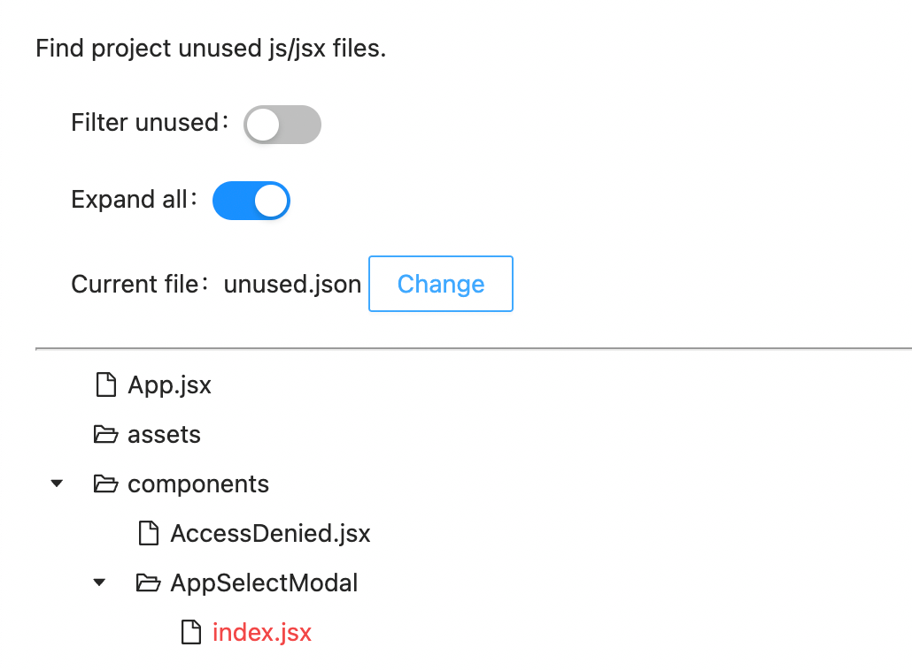

## Find project unused js/jsx files.

1. Execute `node checkUnused.js` or download execute file and `./checkUnused-mac`
2. Copy `unused.json` to this [link](https://www.lilonghe.net/graph-react-unsed-files/).

Red title is unsed file.

